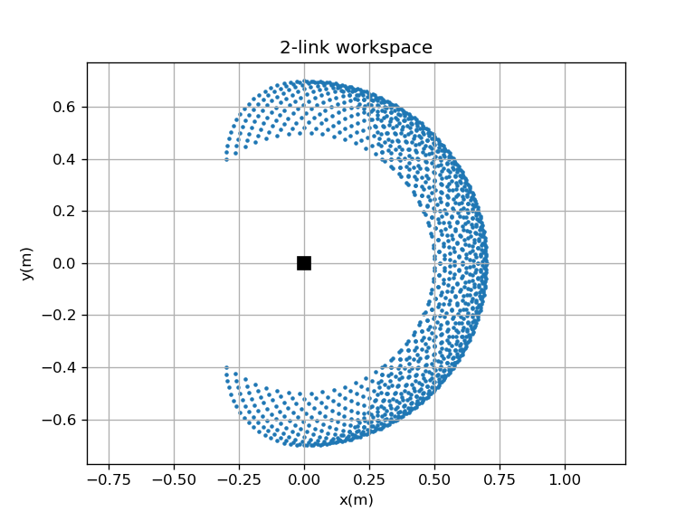

# Robotics Math with C++ / Eigen

Hands-on implementations of core manipulator kinematics using C++17 and Eigen,
built as groundwork for robot motion control.

## What's inside
| File | Topic |
|---|---|
| `01`–`04` | Vectors/matrices, linear solvers (QR, pseudo-inverse), rotations (matrix, quaternion, slerp), homogeneous transforms |
| `05_mini_project_fk.cpp` | Forward kinematics of a 2-link planar arm: trigonometric vs. transform-chain methods |
| `06_fk_project.cpp` | My implementation: FK (2- and 3-link), workspace sampling, numerical vs. analytical Jacobian, singularity analysis |

## Results
**Workspace** (L1 = 0.4 m, L2 = 0.3 m, joint limits ±90°): reachable annulus between 0.5 m and 0.7 m.



**Jacobian**: finite-difference and analytical Jacobians agree to 1e-5.
`det(J) = L1·L2·sin(q2)`, so the arm is singular when fully stretched (q2 = 0),
where both Jacobian columns become parallel and radial motion is lost.

## Build
```bash
sudo apt install libeigen3-dev
cmake -S . -B build && cmake --build build
./build/06_fk_project
```